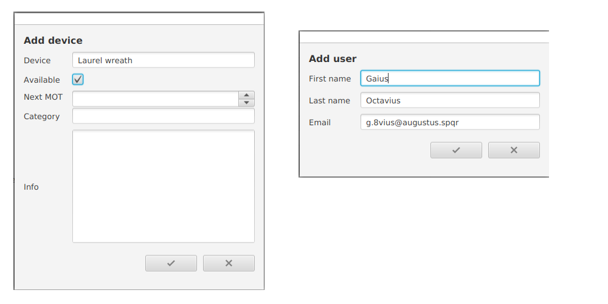

# inventoryManager

This application will help to keep track of items that are currently on loan. It
might be relevant for sports clubs, etc. whenever there are objects on loan to
members for a certain period of time.

The whole "database" will be stored in a JSON file. On start up the information
are stored in the correct views and can be edited as necessary.

## First Steps

To execute the app, the computer at hand must have a Java 8 runtime environment
with JavaFX included. Once launched, the app will create folder
`.inventoryManager` in the user's home directory including a file named
`config.json`. This file will keep track of all recently opened data containers.
By default the last opened container will be reloaded on each start.

## Initial Setup

After openeing the app the very first time there there must be a data container
created before users and items can be added to the overviews. This is done by
clicking the database symbol (s. button bar in the upper part). The created data
container (which is a JSON file as well). The new container will be loaded at
once and its identifier is displayed in the upper right corner of the main
window.

## Overviews

The app has two main dialogs: a user overview and an inventory overview. Both
can be opened by using the related buttons (person and tool icon) in the main
button bar. Creation and deletion of entries is managed in both views by using
the two buttons in the left of the button bar. These buttons will recognize
automatically by the currently opened view which kind of data is to be added or
deleted. If there is no data container opened these buttons are disabled.

In the right part of both views an editor for the currently selected item is
integrated. The changes can either be applied (check mark) or rolled back (X
mark). Note that there is no separate save button, all changes are written to
the container file immediately.

## Managing Data

Once a data container has been loaded, the add/remove buttons become available.
As mentioned above both button's behavior is depending on the view currently
opened. In both dialogs all mandatory fields are validated, so the records can
be saved only, if all required fields have a proper input.

The deletion of records requires a confirmation by the user. Once a record has
been deleted, this cannot be undone. **So take care of regular backups!**

## Lending and Returning Items

There are general two ways of lending items. The first one is selecting the item
in the inventory overview, open the context menu (right click) and click *Lend
to*. This will open a dialog were the lender and the lending date must be set.
Both fields are mandatory.

The second way is triggered from the user overview. Click *Lending devices* in
the context menu. Here multiple items can be lend at once. The selection
contains only those items taht are still available.

Returning items is done via the inventory overview's context menu. When an item
is returned, a history record is created. These records make sure the lending
history of each item can be tracked. The history is accessible from the context
menu as well.

## Next MOT

Although the MOT column is not mandatory, there are a few things to explain.
When the app is started, the colors of the filled cells might change. This is
depending on the months left until the next MOT (the lower bound is always
exclusive):

* if the MOT is 12 to 6 months away, the cell appears dark green
* between 6 and 3 months it appears yellow
* between 3 and 1 month it appears orange
* at 1 month it is marked orange red
* if the MOT is due or expired, the cell is dark red

## Searching Entries

Both overviews have a global search field. Any input there is used to filter the
table entries as you type. The values to be filtered are the table columns.
Additional to that the search in the inventory overview also includes the
optional info text on the right. Note that the input is not case sensitive!
